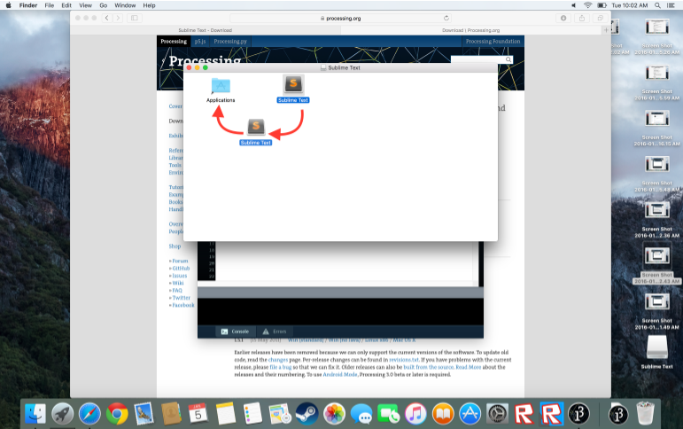
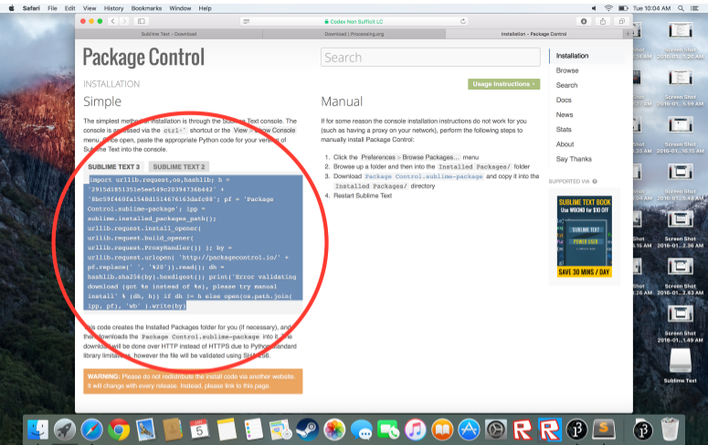
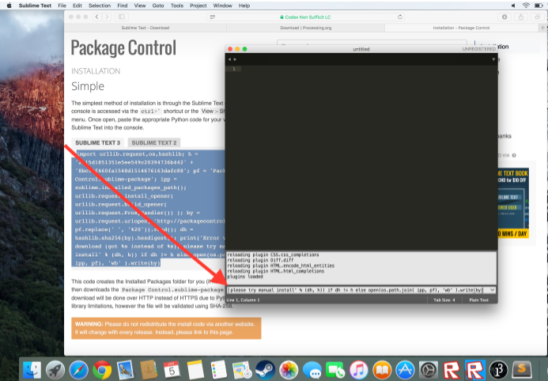
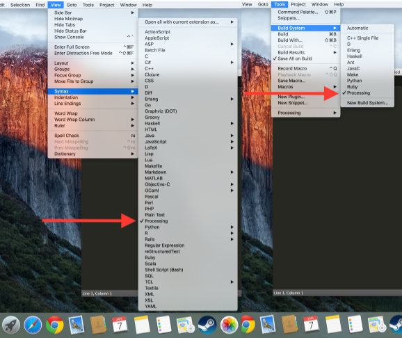

Installing and configuring Sublime on your home Macintosch computer
=============================

To use Sublime at home on your Mac, you will need to install Processing, Sublime Text 3, Package Control and the Processing plugin.

Download and install Processing
---------------
1. Download version 3 of [Processing](https://processing.org/download/?processing)
2. Drag the Processing icon into your applications folder
3. Once you have moved the Processing icon, double click on it in applications and it will open to a new project. Once in processing, go to *Tools* and click on *Install processing.java*.  

4. When asked if you want to install processing for all users, you must click *yes* (processing will not work with sublime otherwise)
After clicking *yes*, input you computer login and processing will install.
5. Now in order for processing to install correctly, restart your computer

Download and install Sublime Text 3
------------------
1. After you restart, go to [http://www.sublimetext.com/3](http://www.sublimetext.com/3) and download Sublime Text 3 for OSX. 
3. Install Sublime Text 3 from downloads by double clicking on the `.dmg` file.
2. When promoted, agree to everything, and drag Sublime Text into your application folder in the opened window  

Install Package Control for Sublime
---------------
1. Start Sublime
2. Choose *View | Show Console*
3. Open a browser, and go to [https://packagecontrol.io/installation](The Sublime Package Control Installation page)
4. Copy the code that sarts with `import urllib.request`  

5. Paste that in the console in Sublime and press enter  

6. (If Package control gives you an error or a message saying “missing dependencies”, just ignore it and click *ok*, the next step will fix this.)
7. In order for package control to install without errors, we need restart the computer again (don’t ask me why it work, it just does)

Install the Processing plugin for Sublime
---------------
1. Once you’ve restarted, open Sublime and check that under *Sublime Text > Preferences* it says *package control* at the bottom of the list (or anywhere in Sublime Text > Preferences)
2. Click on the line that says “package control” and it will open the package control console.
3. Type “Install Package” into the search bar, and click on the line in the results that says “Package Control: Install Package”
4. Once you click *install package*, you will be taken to a list of packages. Search “Processing” and click on the result that simply says “Processing” to install the processing plugin.
5. Once the processing plugin is installed, right clock on Sublime in the dock, and click *quit*. (Simple clicking the red bottom will NOT stop the Sublime background scripts.)

Configure the Processing plugin for Sublime
---------------
1. Restart Sublime
2. In Sublime choose *Tools | Build System | Processing*
3. Choose *View | Syntax | Processing*  
  

Congratulations, you’ve installed Sublime Text 3 with Processing!  

*Thanks to Andre Simmons for his help with these instructions!*

